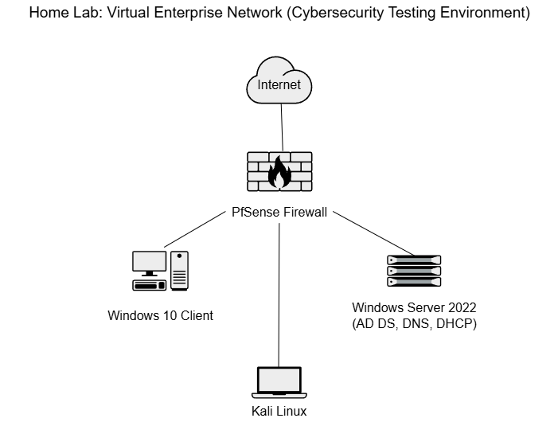
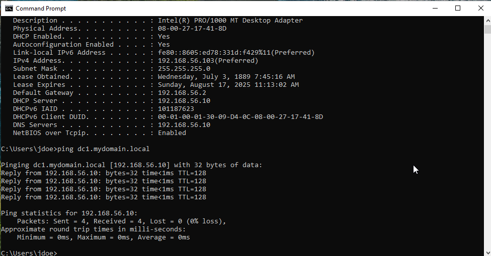

# Virtual Enterprise Network Lab (Cybersecurity-Focused)

## Project Overview

This project simulates a full-stack enterprise network inside a virtual lab environment. It includes a pfSense firewall, a Windows Server 2022 domain controller with DHCP, DNS, and Active Directory services, a Windows 10 domain-joined client, and a Kali Linux attacker machine. The goal is to showcase core IT and cybersecurity concepts such as domain authentication, internal network segmentation, and penetration testing in a safe and controlled setup.

### Lab Goals

- Build and configure a full-stack virtual enterprise network
- Apply core networking concepts (VLANs, DHCP, DNS, routing, subnetting)
- Set up Active Directory and Group Policy in a Windows Server domain
- Configure pfSense as a firewall and VPN gateway
- Practice security hardening and monitoring using Kali Linux
- Perform basic domain enumeration and pentesting simulations
- Document configurations and troubleshoot network issues

## Network Diagram

The following diagram represents the logical layout of the network used in this lab.



## Lab Components

pfSense Firewall
- Serves as the primary router and firewall for the lab
- NAT and firewall rules for controlling internal/external traffic
- Optional IDS/IPS (Snort or Suricata)

Windows Server 2022
- Promoted to Domain Controller (mydomain.local)
- Active Directory Domain Services (AD DS)
- DNS and DHCP roles
- File sharing with NTFS and Share permissions
- Group Policy for user/device restrictions

Windows 10 Client
- Joined to the Active Directory domain
- Receives IP via DHCP from Windows Server
- Subject to GPO restrictions
- Able to access domain resources and shared folders

Kali Linux
- Used for penetration testing and internal reconnaissance
- Tools used: rpcclient, Kerbrute, Nmap, smbclient, and others
- Demonstrates lateral movement and domain enumeration techniques

## Tools and Technologies

- VirtualBox (hypervisor)
- pfSense firewall
- Windows Server 2022
- Windows 10 Pro
- Kali Linux
- Wireshark
- Kerbrute
- rpcclient
- smbclient
- Group Policy Editor
- Event Viewer

## Skills Demonstrated

- Network design and subnetting
- pfSense configuration and firewall rule management
- DHCP and DNS role configuration
- Active Directory domain setup
- Group Policy creation and deployment
- Domain client joining and access control
- File sharing with NTFS and Share permissions
- Basic penetration testing and enumeration
- Use of terminal tools and scripting in Kali Linux
- Traffic analysis using Wireshark

## Folder Structure
```
/
├── README.md
├── /screenshots
│   ├── /gpo
│   │   ├── gpo_linked_policies.png
│   │   ├── gpo_labclients_settings.png
│   │   └── gpo_labclients_enforced.png
│   ├── /pfsense
│   ├── /windows_server
│   ├── /kali
│   └── network_diagram.png
├── /configs
│   ├── pfsense_rules.txt
│   ├── dns_scope.txt
│   └── gpo_settings.md
├── /docs
│   ├── setup_notes.md
│   └── troubleshooting_log.md
```
## Lab Host Machine Specifications

This lab was built and tested using the following hardware:

- CPU: AMD Ryzen 5 7500F
- GPU: AMD RX 7800 XT
- RAM: 32 GB DDR5
- Storage: 2 TB NVMe SSD
- Host OS: Windows 11
- Virtualization Software: Oracle VirtualBox

## Notes

- All screenshots and configurations are based on a real, working home lab running on a Ryzen 5 desktop with VirtualBox.
- This lab was built to support job applications in IT support, networking, and cybersecurity roles.
- Project is actively being expanded with more advanced features like IDS/IPS and vulnerability scanning.

## Learning Outcomes

- Strengthened practical understanding of networking fundamentals, including DNS, DHCP, and Active Directory
- Gained experience configuring firewall rules, NAT, and gateway settings with pfSense
- Applied real-world Group Policy configurations to manage and secure client machines
- Practiced system hardening and network enumeration using Kali Linux tools
- Developed troubleshooting skills by resolving IP conflicts, DNS resolution issues, and GPO errors
- Built confidence deploying and maintaining a segmented enterprise-style network environment
- Documented technical work in a clear and organized way to showcase to recruiters
## Screenshots

## Client

### Client Ping Domain Controller
Demonstrates successful ping from the Windows 10 client to the domain controller.


### Domain Verification via Command Prompt
Verifies the domain membership of the Windows 10 client using `whoami` and `echo %USERDOMAIN%`.


### Group Policy Result (gpresult)
Shows applied GPOs on the client machine.


### Client IP Configuration (DHCP)
Displays IP configuration showing DHCP-assigned IP from Windows Server.


### Mapped Network Client
Shows mapped network drives from the domain.


### Shared Docs from Client
Demonstrates access to shared folders from the Windows Server.


### Whoami on Client
Confirms logged-in domain account on the client.


## Kali

### CrackMapExec SMB Scan
Performs SMB scan against the domain network.


### CrackMapExec SMB Shares
Lists SMB shares discovered on the target.


### Nmap Scan from Kali
Performs Nmap scan of the target host.


### RPCClient Enumeration
Enumerates domain info using rpcclient.


### SMB Enumeration
Enumerates SMB services and shares.


## GPO

### GPO Lab Clients Enforced
Shows enforced GPOs for lab clients.


### GPO Lab Clients Settings
Displays settings configured in the lab clients GPO.


### GPO Linked Policies
Shows GPOs linked to the domain.


## pfSense

### pfSense Dashboard
Main dashboard view of pfSense firewall.


### pfSense DHCP Settings
Configured DHCP server settings.


### pfSense Firewall LAN Rules
LAN interface firewall rules configuration.


### pfSense Firewall WAN Rules
WAN interface firewall rules configuration.


### pfSense Gateways
Gateway configuration in pfSense.


### pfSense LAN Settings
LAN interface network settings.


### pfSense NAT Outbound
NAT outbound mapping configuration.


### pfSense NAT Port Forwarding
Port forwarding rules configuration.


### pfSense WAN Settings
WAN interface settings configuration.


## Windows Server

### Active Directory Users and Computers
Shows created users and groups in AD.


### DHCP Scope
DHCP scope configuration.


### DHCP Scope Options
Additional DHCP options set.


### DNS Forward Lookup
Forward lookup zone in DNS Manager.


### Server Manager Dashboard
Overview of roles and services installed.


### Shared Folders
Shared folders configuration in Windows Server.

